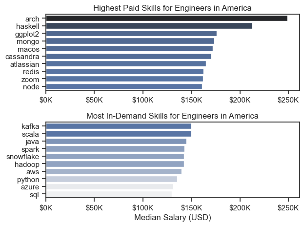

# Overview
---
Welcome to my analysis of the data job market, with a specific focus on engineering roles across America. This project was born from my desire to sharpen my Python skills while gaining deeper insights into the evolving landscape of data jobs. By analyzing key trends, I aim to uncover what recruiters are seeking in different engineering positions.

In this analysis, I explore:

- Top-paying and in-demand skills for engineers.
- Salary trends across various locations.
- The intersection of demand and salary to identify optimal job opportunities.

The data is sourced from [Luke Barousse's Python Course](https://lukebarousse.com/python), providing a comprehensive foundation with detailed information on job titles, salaries, locations, and essential skills. Using Python as my primary tool, I performed in-depth queries and visualizations to extract actionable insights.

This project is a reflection of my growing expertise in data analysis and my curiosity about the job market dynamics. I hope this analysis serves as a useful resource for anyone exploring career opportunities in data engineering.

# The Questions
---
Below are the questions I want to answer in my project:

1. What are the most demanded skills for Engineers?
2. How are in-demand skills trending for Engineers?
3. How well do jobs and skills pay for Engineers in America?
4. What is the most optimal skill to learn for Engineers?

# Tools I Used
---
For my deep dive into the data job market for engineering roles, I used several key tools:

- **Python:** The backbone of my analysis allowing me to analyze the data and find critical insights. I also used the following Python librarise:
    - **Pandas Library:** This was used to analyze the data.
    - **Matplotlib Library:** I visualized the data.
    - **Seaborn Library:** Helped me create more advanced visuals.
- **Jupyter Notebooks:** The tool I used to run my Python scripts which let me easily include my notes and analysis.
- **Visual Studio Code:** The coding enviroment I used to execute my Python scripts.
- **Git & GitHub:** Essential for version control and sharing my Python code and analysis, ensuring collaboration and project tracking.

# Data Preparation and Cleanup
---
This section outline the steps taken to prepare the data for analysis, ensuring accuracy and usability.
## Import & Clean Up Data
---
I start by importing necessary libraries and loading the dataset followed by initial cleaning tasks to ensure data quality.

```python
import ast
import pandas as pd
from datasets import load_dataset
import matplotlib.pyplot as plt
import seaborn as sns

dataset = load_dataset('lukebarousse/data_jobs')
df = dataset['train'].to_pandas()

df['job_posted_date'] = pd.to_datetime(df['job_posted_date'])
df['job_skills'] = df['job_skills'].apply(lambda x: ast.literal_eval(x) if pd.notna(x) else x)  
```

## Filter Jobs From America
---
To focus my analysis on the American job market, I applied the following filters to the dataset, narrowing down to rales based in American countries.

```python
american_countries = [
    'United States', 'Canada', 'Mexico', 'Brazil', 'Argentina', 'Colombia',
    'Chile', 'Peru', 'Venezuela', 'Ecuador', 'Bolivia', 'Paraguay',
    'Uruguay', 'Guyana', 'Suriname', 'Panama', 'Costa Rica', 'Guatemala',
    'Honduras', 'Nicaragua', 'El Salvador', 'Belize', 'Cuba', 'Haiti',
    'Dominican Republic', 'Jamaica', 'Trinidad and Tobago', 'Bahamas'
]

df_america = df[df['job_country'].isin(american_countries)]
```

# The Analysis
---
Each Jupyter notebook for this project aimed at investigating specific aspects of the data job market. Here's how I approached each question:

## 1. What are the most demanded skills for Engineers?
---
To find the most demanded skills for engineering data roles. I filtered out those positions by which ones were the most popular, and got the top 5 skills for these roles. This query highlights the most popular job titles and their top skills, showing which skills I should pay attention to depending on the role I'm targeting.

View my notebook with detailed steps here: [2_Skill_Demand](2_Skill_Demand.ipynb).

### Visualize Data
```python
fig, ax = plt.subplots(len(job_titles), 1, figsize=(7, 10))

sns.set_theme(style='ticks')

for i, job_title in enumerate(job_titles):
    df_plot = df_skills_perc[df_skills_perc['job_title_short'] == job_title].head(5)
    sns.barplot(data=df_plot, x='skill_percent', y='job_skills', ax=ax[i], hue='skill_count', palette='dark:b_r')
    ax[i].set_title(job_title)
    ax[i].set_ylabel('')
    ax[i].set_xlabel('')
    ax[i].get_legend().remove()
    ax[i].set_xlim(0, 78)

    for n, v in enumerate(df_plot['skill_percent']):
        ax[i].text(v+1, n, f'{v:.0f}%', va='center')

    if i != len(job_titles) - 1:
        ax[i].set_xticks([])

fig.suptitle('Likelihood of Skills Requested for Engineers in America', fontsize=15)
plt.tight_layout(h_pad=0.5)
plt.show()
```

### Results


*Bar graph visualizing the salary for engineering data roles and their top 5 skills associated with each.*

### Insights

- Python and SQL are essential accross all engineering roles, especially for Data Engineers and Machine Learning Engineers.
- Cloud Platforms like AWS and Azure are highly valued, particularly for Cloud Engineers and Senior Roles.
- Specialized Skills matter:
    - Spark for Data Engineers
    - TensorFlow and PyTorch for Machine Learning Enineers
    - Linux for Cloud Engineers
- Career Growth: Focusing on Python, SQL, and a cloud platform will significantly improve job prospects.

## 2. How are in-demand skills trending for Engineers?
---
To find how skills are trending in 2023 for Engineers, I filtered job titles that contained 'Engineer' in the title and grouped the skills by the month of the job postings. This got me the top 5 skills of engineering roles by month, showing how popular skills were throughout 2023.

View my notebook with detailed steps here: [3_Skills_Trend](3_Skills_Trend.ipynb)

### Visualize Data
```python
from matplotlib.ticker import PercentFormatter

df_plot = df_america_percent.iloc[:, :5]
sns.lineplot(data=df_plot, dashes=False, legend='full', palette='tab10')
sns.set_theme(style='ticks')
sns.despine()

plt.title('Trending Top Skills for Engineers in America')
plt.ylabel('Likelihood in Job Posting')
plt.xlabel('2023')
plt.legend().remove()
plt.gca().yaxis.set_major_formatter(PercentFormatter(decimals=0))

for i in range(5):
    plt.text(11.2, df_plot.iloc[-1, i], df_plot.columns[i], color='black')

plt.show()
```

### Results


*Line graph visualizing the trending skills for engineering roles in America in 2023*

### Insights

- Python and SQL are consistently the most in-demand skills for engineering roles, peaking in May with around 64% demand.
- AWS remains more popular than Azure for cloud roles, with the highest demand in February (43%).
- Demand for all skills drops in July-August, followed by a recovery in November.
- Spark demand is stronger in early 2023 but declines toward the end of the year.
- Focus on Python, SQL, and AWS to maximize job opportunities, especially in spring and fall hiring periods.

## 3. How well do jobs and skills pay for Engineers in America?
---
To identify the highest-paying roles and skills, I only got jobs in America and looked at their median salary. But first I looked at the salary distributions of Engineering roles, to get an idea of which jobs are paid the most.

View my notebook with detailed steps here: [4_Salary_Analysis](4_Salary_Analysis.ipynb)

### Visualize Data
```python
sns.boxplot(data=df_america_engineers, x='salary_year_avg', y='job_title_short', order=job_order)
sns.set_theme(style='ticks')
sns.despine()

plt.title('Salary Distributions of Data Engineers in America')
plt.xlabel('Yearly Salary (USD)')
plt.ylabel('')
plt.xlim(0, 450000) 
ticks_x = plt.FuncFormatter(lambda y, pos: f'${int(y/1000)}K')
plt.gca().xaxis.set_major_formatter(ticks_x)
plt.show()
```

### Results


*Box plot visualizing the salary distributions for engineering roles.*

### Insights

- There's a significant variation in salary ranges across different job titles. Senior Data Engineer, and Machine Learning Engineer positions tend to have the highest salary potential, with up to $400k, indicating the high value placed on advanced data skills and experience in the industry.

- Senior Data Engineer roles show a considerable number of outliers on the higher end of the salary spectrum, suggesting that exceptional skills or circumstances can lead to high pay in these roles. In contrast, Cloud Engineer roles demonstrate more consistency in salary, with no outliers in their salary.

- The median salaries increase with the seniority and specialization of the roles. Senior roles not only have higher median salaries but also larger differences in typical salaries, reflecting greater variance in compensation as responsibilities increase.

## Highest Paid & Most Demanded Skills for Engineers

Next, I looked at the highest-paid skills and the most in-demand skills. I used two bar charts to showcase these.

### Visualize Data
```python
fig, ax = plt.subplots(2, 1)  

sns.set_theme(style='ticks')

sns.barplot(data=df_DE_top_pay, x='median', y=df_DE_top_pay.index, hue='median', ax=ax[0], palette='dark:b_r')
ax[0].legend().remove()
ax[0].set_title('Highest Paid Skills for Engineers in America')
ax[0].set_ylabel('')
ax[0].set_xlabel('')
ax[0].xaxis.set_major_formatter(plt.FuncFormatter(lambda x, _: f'${int(x/1000)}K'))

sns.barplot(data=df_DE_skills, x='median', y=df_DE_skills.index, hue='median', ax=ax[1], palette='light:b')
ax[1].legend().remove()
ax[1].set_title('Most In-Demand Skills for Engineers in America')
ax[1].set_ylabel('')
ax[1].set_xlabel('Median Salary (USD)')
ax[1].set_xlim(ax[0].get_xlim())
ax[1].xaxis.set_major_formatter(plt.FuncFormatter(lambda x, _: f'${int(x/1000)}K'))

plt.tight_layout()
plt.show()
```

### Results

Here's the breakdown of the highest-paid & most in-demand skills for Engineers in America:



*Graphs visualizing the highest paid skills and most in-demand skills for Engineers in America*

### Insights

- Rare skills like Arch and Haskell offer extremely high salaries, exceeding $200k, but have very limited job opportunities.
- Popular skills like SQL, Python, and AWS are consistently in demand with salaries ranging from $130K to $140K.
- Balanced Choices: Skills like Spark, Java and Snowflake provide both good salaries and steady demand, making them ideal for career growth.

## 4. What is the most optimal skill to learn for Engineers?
---
To identify the most optimal skills to learn (the ones that are the highest paid and highest demand) I calculated the percent of skill demand and the median salary of these skills. To easily identify which are the most optimal skills to learn.

View my notebook with detailed steps here: [5_Optimal_Skills](5_Optimal_Skills.ipynb).

### Visualize Data

```python
from adjustText import adjust_text

plt.scatter(df_DE_skills_high_demand['skill_percent'], df_DE_skills_high_demand['median_salary'])
plt.xlabel('Percent of Engineering Jobs')
plt.ylabel('Median Salary ($USD)')
plt.title('Most Optimal Skills for Engineers in America')

ax = plt.gca()
ax.yaxis.set_major_formatter(plt.FuncFormatter(lambda y, pos: f'${int(y/1000)}K'))

texts = []
for i, txt in enumerate(df_DE_skills_high_demand.index):
    texts.append(plt.text(df_DE_skills_high_demand['skill_percent'].iloc[i], df_DE_skills_high_demand['median_salary'].iloc[i], " " + txt))

adjust_text(texts, arrowprops=dict(arrowstyle='->', color='gray'))

plt.show()
```

### Results


*A scatter plot visualizing the most optimal skills (high paying & high demand) for engineers in America*

### Insights

- The skills Scala and Kafka appear to have the highest median salary of nearly $150K, despite being less common in job postings. This suggests a high value placed on specialized programming and specific libraries skills within the engineering data roles.

- More commonly required skills like Python and SQL have a large presence in job listings but lower median salaries compared to specialized skills like AWS or Java, which not only have higher salaries but are also moderately prevalent in job listings.

- Skills such as Python, SQL, and AWS are towards the higher end of the salary spectrum while also being fairly common in job listings, indicating that proficiency in these tools can lead to good opportunities in Engineering roles.

## Visualizing Different Technologies

I wanted to visualize the different technologies as well in the graph. For that i added color labels based on the technology (e.g. {Programming: Python})

```python
from adjustText import adjust_text

plt.scatter(df_DE_skills_high_demand['skill_percent'], df_DE_skills_high_demand['median_salary'])
plt.xlabel('Percent of Engineering Jobs')
plt.ylabel('Median Salary ($USD)')
plt.title('Most Optimal Skills for Engineers in America')

ax = plt.gca()
ax.yaxis.set_major_formatter(plt.FuncFormatter(lambda y, pos: f'${int(y/1000)}K'))

texts = []
for i, txt in enumerate(df_DE_skills_high_demand.index):
    texts.append(plt.text(df_DE_skills_high_demand['skill_percent'].iloc[i], df_DE_skills_high_demand['median_salary'].iloc[i], " " + txt))

adjust_text(texts, arrowprops=dict(arrowstyle='->', color='gray'))

plt.show()
```

### Results


*A scatter plot visualizing the most optimal skills (high paying & demand) for engineers in America with color labels for technology*

### Insights:

- The scatter plot shows that most of the programming skills (colored blue) tend to cluster at higher salary levels compared to other categories, indicating that programming expertise might offer greater salary benefits within engineering data roles.

- The cloud  skills (colored orange), such as redshift and snowflake, are associated with some of the highest salaries among engineering tools. This indicates a significant demand and valuation for data management and manipulation expertise in the industry.

- Having knowledge with differente programming libraries (colored green), spark are very prevalent in job postings and offer competitive salaries, showing that complementing programming skills with some knowledge in libraries can enhance you engineering career. This category not only has good salaries but is also versatile across different types of data tasks.

# What I Learned
---
Throughout this project, I deepened my understanding of the engineering roles inside the data job market, I was able to enhance my technical skills in Python, especially in data manipulation and visualization. Some of the thing I've learned are the following:

- **Advanced Python Usage:** I enhanced my ability to work with libraries like Pandas for data manipulation, Seaborn and Matplotlib for visualization, and other specialized libraries to streamline complex data analysis.
- **Data Cleaning Importante:** I realized the critical role of thorough data cleaning and preparation. Ensuring data accuracy and consistency is essential for reliable analysis and meaningful insights.
- **Strategic Skill Analysis:** By analyzing skill demand, salary trends, and job availability, I learned the value of aligning my career development with market needs. This strategic approach enables more informed decisions when acquiring new skills.

# Insights
---
This projcet provided several general insights into the data job market for engineers:

- **Skill Demand and Salary Correlation:** Highly sought-after skills tend to command higher salaries, emphasizing the importance of acquiring in-demand expertise for better earning potential.
- **Market Trends:** Skill demand fluctuates over time, reflecting the evolving nature of the data job market. Staying updated on emerging trends is crucial for maintaining a competitive edge.
- **Economic Value of Skills:** Engineers can make informed career decisions by focusing on skills that are both in high demand and well-compensated, ensuring greater economic returns and long-term career growth.

# Challenges I Faced
---
The realization of this project came with several challenged that I used as opportunities to learn:

- **Data Inconsistencies:** Managing missing or inconsistent data entries required careful data-cleaning techniques to maintain the accuracy and reliability of the analysis.
- **Complex Data Visualization:** Creating clear and meaningful visual representations of complex datasets was challenging but essential for effectively communicating insights.
- **Balancing Breadth and Depth:** Striking a balance between exploring detailed insights and maintaining a broader perspective of the data market was crucial to avoid losing focus.

# Conclusion
---
This exploration of the engineering roles within the data job market has helped me a lot, to learn about the critical skills and trends that shape this field. As an engineer looking to learn about the data job market, this has been very interesting to say the least. Thanks to this project I was able to enhance my understanding and provide actionable guidance for anyone loking to advance their career as an engineer in the data field. This project is a great foundation for future explorations and to emphasize the importance of continuous learning and adaptation in the data field.